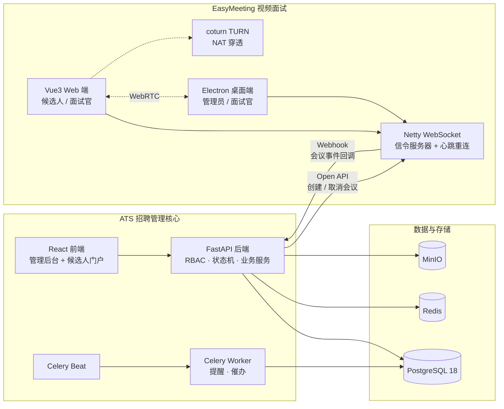

<div align="center">

# ATS 招聘流程管理系统

**一套面向中小型科技企业的招聘全流程管理平台** · 把职位发布、候选人追踪、面试协同、Offer 审批到入职的全链路打通，并内置视频面试能力。

</div>

---

> **是什么 · 解决什么 · 面向谁**
> ATS 是一套面向中小型科技企业 HR 与用人团队的招聘流程管理系统，将分散的招聘协作收敛为可追踪、可度量、可审计的一体化平台。
>
> **为什么做**
> 让企业招聘从碎片化协作升级为状态机驱动的一体化流程，并通过内置视频面试开箱即用地支撑远程招聘，沉淀可复用的招聘数据资产。

---

## 目录

- [功能特性](#功能特性)
- [系统架构](#系统架构)
- [技术栈](#技术栈)
- [快速开始](#快速开始)
- [项目规划](#项目规划)

---

## 功能特性

**职位与候选人**

- **职位管理**：创建 / 编辑 / 发布 / 关闭 / 重新打开，支持审批流程与编制（headcount）控制
- **候选人管理**：简历上传（MinIO 对象存储）、标签体系、多条件搜索、邮箱去重
- **候选人门户**：公开职位浏览、在线投递、邮箱验证码登录、申请状态自助查询

**招聘协同**

- **招聘看板**：Kanban 式拖拽推进（投递 → 筛选 → 面试 → Offer → 入职），批量推进、按评分 / 推荐排序
- **面试管理**：面试官时间冲突检测（±30 分钟）、多轮面试、评价打分、取消、详情回看
- **视频面试**：内置 EasyMeeting，安排面试即自动创建会议，候选人通过浏览器免登录入会
- **Offer 管理**：自动生成 Draft、薪资编辑、审批流（提交 → 审批 → 发送）、候选人门户接受 / 拒绝

**平台能力**

- **权限体系**：RBAC 四角色（admin / hr / hiring_manager / interviewer）+ 数据范围（全部 / 本部门 / 本人）服务层注入
- **状态机**：申请、职位、Offer、面试四套独立状态机，所有流转受约束可审计
- **通知系统**：面试提醒、评价催办（Celery Beat 定时扫描，去重防骚扰）
- **审计日志**：关键操作变更全量记录，支持追溯
- **数据分析**：招聘漏斗、渠道转化、待办仪表盘、待评价统计
- **国际化**：默认中文，可一键切换英文

---

## 系统架构

系统由 **ATS 核心**（本仓库的 backend + frontend）与 **EasyMeeting 视频面试**（`easymeeting/` 子项目）两部分组成，通过开放 API 与 Webhook 双向集成。



**集成链路**

- **正向**：ATS 安排面试 → 调用 EasyMeeting 开放接口（`X-API-Key` 鉴权）创建会议 → 邮件通知含会议链接与号码。
- **反向**：EasyMeeting 会议结束 / 取消 → Webhook 回调 ATS → 按业务规则更新面试状态（会议结束不自动评价，仅提交评价才推进为已完成）。
- **多节点信令**：EasyMeeting 通过 Redisson（Redis Pub/Sub）路由跨节点的 WebSocket 信令，支持水平扩展。

**项目结构**

```
.
├── backend/              # FastAPI 后端（API · 服务 · 状态机 · Celery 任务）
│   └── app/
│       ├── api/routes/   # admin / portal / integrations(webhook)
│       ├── services/     # 业务服务层（含数据范围注入）
│       ├── core/         # 配置 · 安全 · 权限 · 状态机 · Celery
│       ├── tasks/        # 定时任务（面试提醒 · 评价催办）
│       └── alembic/      # 数据库迁移
├── frontend/             # React + TS 管理后台与候选人门户
├── easymeeting/          # 视频面试子系统
│   ├── easymeeting-java/ # Spring Boot + Netty 信令服务 + 开放 API
│   ├── easymeeting-web/  # Vue3 浏览器端（访客 / 候选人入会）
│   └── easymeeting-front/# Electron + Vue3 桌面端
├── compose.yml           # 生产编排（Traefik · HTTPS · 各服务）
└── compose.override.yml  # 本地开发覆盖（端口映射 · 源码挂载）
```

---

## 技术栈

| 层级 | 技术选型 |
| --- | --- |
| **后端** | Python 3.14 · FastAPI · SQLModel · Pydantic v2 · Alembic · Celery · structlog · PyJWT |
| **数据存储** | PostgreSQL 18 · Redis 7 · MinIO（对象存储 / 简历） |
| **前端** | React 19 · TypeScript · TanStack Router/Query/Table · shadcn/ui（Radix）· Tailwind CSS 4 · Vite · Zod |
| **视频面试** | Spring Boot 2.7 · Netty · Redisson · MyBatis · WebRTC · Electron · Vue 3 · Element Plus |
| **质量保障** | pytest · mypy(strict) · ruff · Playwright · Biome |
| **部署运维** | Docker Compose · Traefik 3（反向代理 / HTTPS）· Sentry（异常监控） |

---

## 快速开始

### 一键启动（Docker Compose）

```bash
docker compose watch
```

启动后访问：

| 服务 | 地址 |
| --- | --- |
| 前端（管理后台 + 门户） | http://localhost:5173 |
| 后端 API | http://localhost:8000 |
| API 文档（Swagger） | http://localhost:8000/docs |
| Adminer（数据库） | http://localhost:8080 |
| Traefik 控制台 | http://localhost:8090 |
| Mailcatcher（邮件捕获） | http://localhost:1080 |

### 本地开发（脱离容器单独运行）

```bash
# 后端
cd backend
fastapi dev app/main.py

# 前端
bun run dev          # 或 npm run dev
```

### 视频面试子系统（EasyMeeting）

```bash
# 信令服务（Spring Boot）
cd easymeeting/easymeeting-java && mvn spring-boot:run

# 浏览器端（候选人 / 面试官）
cd easymeeting/easymeeting-web && npm run dev

# 桌面端（管理员 / 面试官）
cd easymeeting/easymeeting-front && npm run dev
```

---


